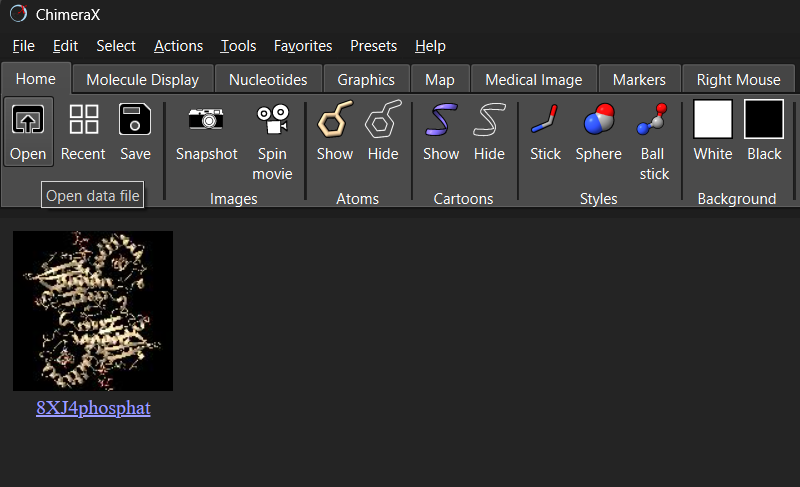
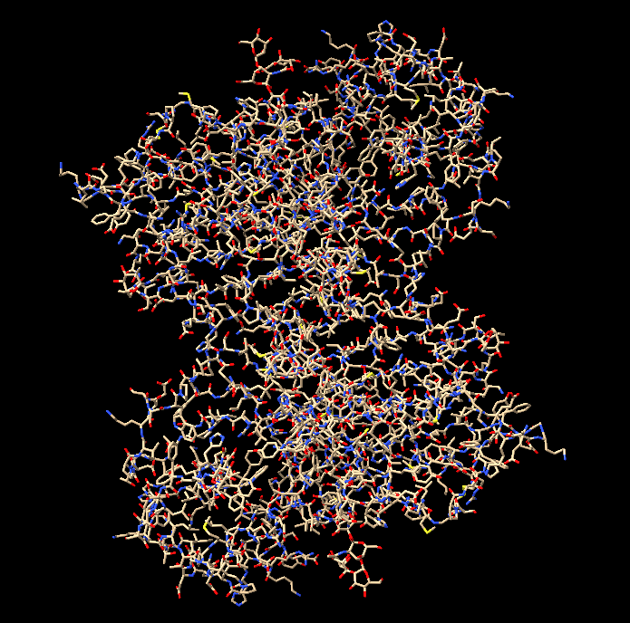
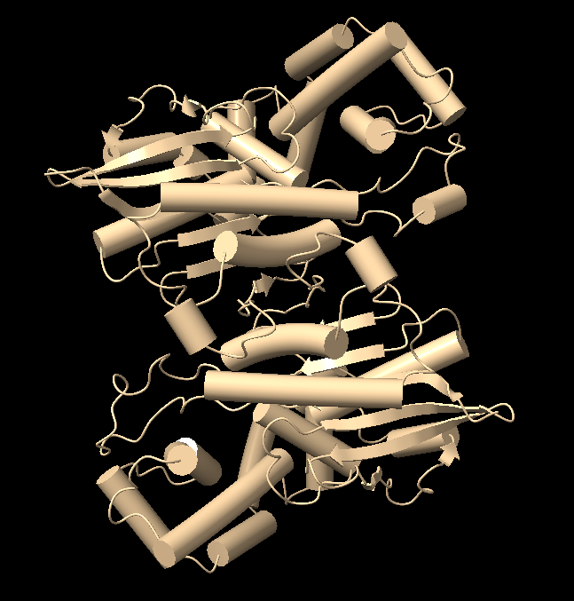
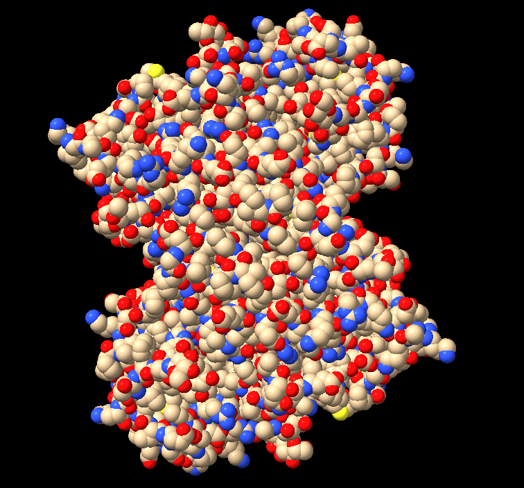
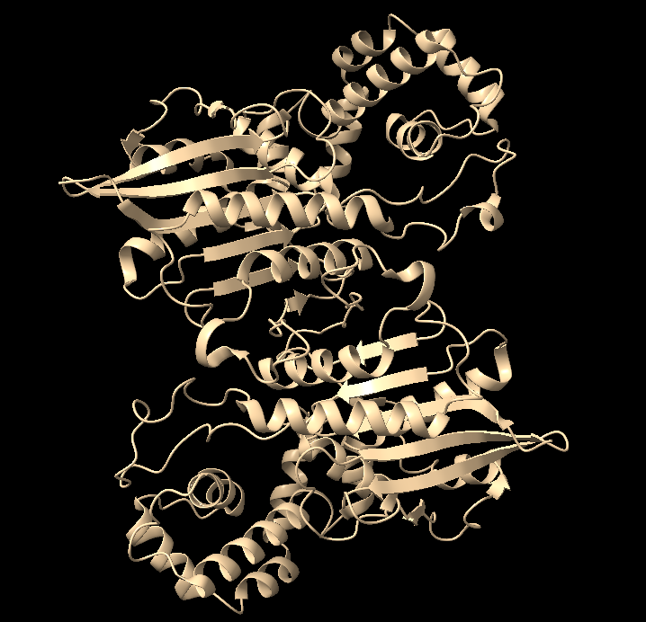
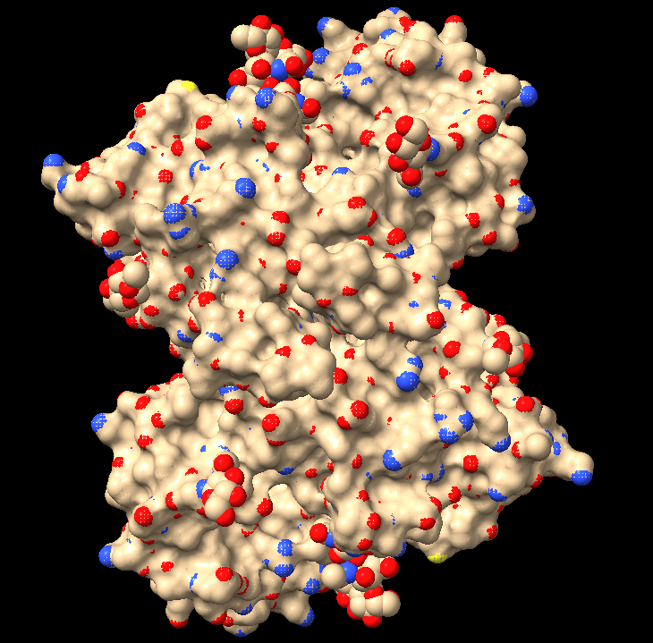
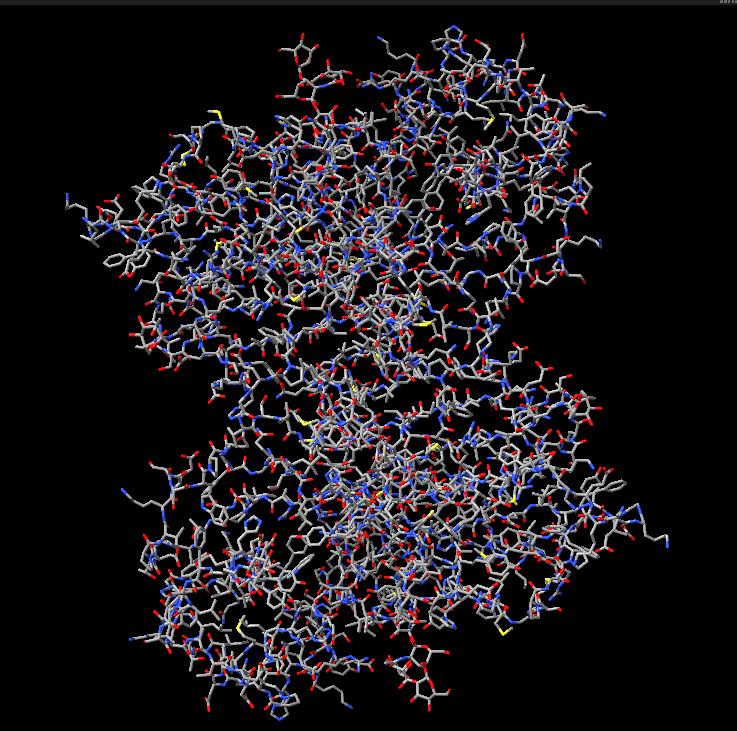
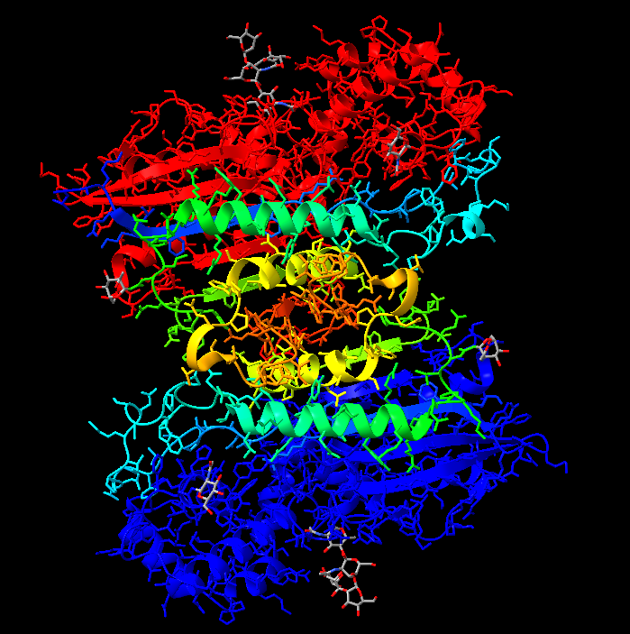
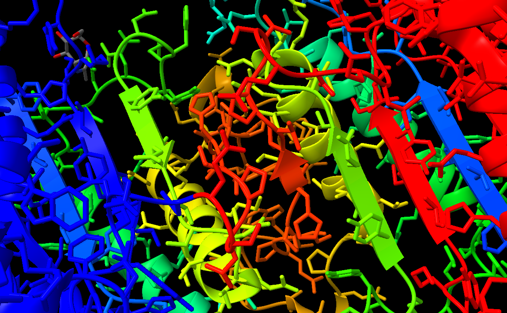
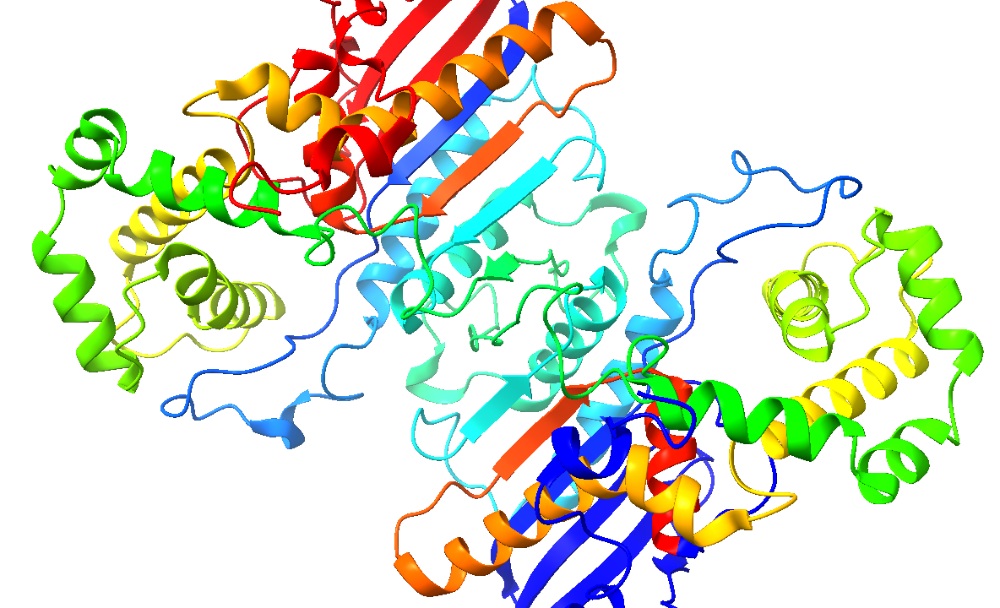

# Визуализация структуры белка

Выполнил: **Цой Антон 22214**

## О работе

Название ПО для визуализации: **UCSF ChimeraX** (https://www.cgl.ucsf.edu/chimerax/)

Ссылка на структуру белка: https://www.rcsb.org/structure/8XJ4

## Визуализации

Открываем во вкладке `Open` наш PDB файл.



### Wireframe

Используем коммандную строку. Отключаем режим ленточек, включаем режим атомов, визуализируем их как тонкие стержни:
```cli
hide cartoons
show atoms
style stick
```



### Backbone

Команды:
```cli
hide atoms
show cartoons
cartoon style modeHelix tube
```



### Spacefill

Команды:
```cli
hide cartoons
show atoms
style sphere
```



### Ribbons

Команды:
```cli
hide atoms
show cartoons
cartoon style modeHelix default
```



### Molecular surface

Команды:
```cli
hide cartoons
show atoms
surface
```



## Раскраска

### Цветовой моделью CPK

Команды:
```cli
hide surface
style stick
color byelement
```



### Различными цветами по доменам (частям) белка

Команды:
```cli
show cartoons
rainbow :1-150
```



## Изображение белка публикационного качества



