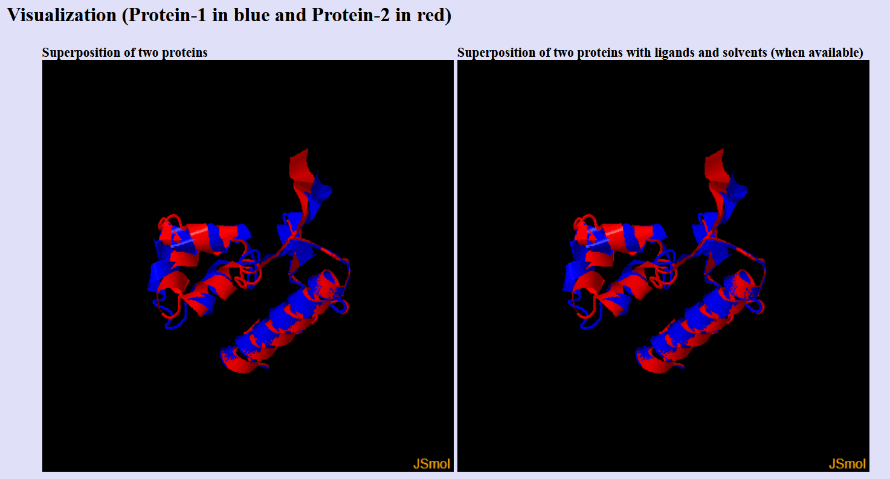

# Предсказание и парное выравнивание структур белков

Выполнил: **Цой Антон 22214**

## О работе

**Последовательность**: MSTLTSVSGFPRIGQNRELKKIIEGYWKGANDLAAVKATAAELRAKHWRLQQAAGIDLIASNDFSYYDQMLDTAILLNVIPQRYQRLAFDDQEDTLFAMA

**Программы-предсказатели**:
- ESMFold
- AlphaFold2

**Программа-выравниватель**: TMAlign (https://aideepmed.com/TM-align/)

## Ноутбуки предсказанных структур
- [ESMFold](ESMFold.ipynb)
- [AlphaFold2](AlphaFold2.ipynb)

## Предсказания структур в формате PDB

- [ESMFold](esmfold.pdb)
- [AlphaFold2](alfafold2.pdb)

## Выдача программы выравнивания

### TM-align Results

```bash
 **************************************************************************
 *                        TM-align (Version 20190822)                     *
 * An algorithm for protein structure alignment and comparison            *
 * Based on statistics:                                                   *
 *       0.0 < TM-score < 0.30, random structural similarity              *
 *       0.5 < TM-score < 1.00, in about the same fold                    *
 * Reference: Y Zhang and J Skolnick, Nucl Acids Res 33, 2302-9 (2005)    *
 * Please email your comments and suggestions to: zhanglab@zhanggroup.org *
 **************************************************************************

Name of Chain_1: A252729
Name of Chain_2: B252729
Length of Chain_1:  100 residues
Length of Chain_2:  100 residues

Aligned length=   99, RMSD=   1.91, Seq_ID=n_identical/n_aligned= 0.980
TM-score= 0.82188 (if normalized by length of Chain_1)
TM-score= 0.82188 (if normalized by length of Chain_2)
(You should use TM-score normalized by length of the reference protein)

(":" denotes aligned residue pairs of d < 5.0 A, "." denotes other aligned residues)
MSTLTSVSGFPRIGQNRELKKIIEGYWKGANDLAAVKATAAELRAKHWRLQQAAGIDLIASNDFSYYDQMLDTAILLNVIPQRYQRL-AFDDQEDTLFAMA
.:::::::::::::::::::::::::::::::::::::::::::::::::::::::::::::::::::::::::::::::::::::: :: ::::::::::
MSTLTSVSGFPRIGQNRELKKIIEGYWKGANDLAAVKATAAELRAKHWRLQQAAGIDLIASNDFSYYDQMLDTAILLNVIPQRYQRLAFD-DQEDTLFAMA
```

### Document downloads

Submitted structural alignment is completed and the results are available at: https://zhanggroup.org/TM-align/tmp/252729.html

* The two structures that you submitted can be found at at:
  * https://zhanggroup.org/TM-align/tmp/A252729.pdb
  * https://zhanggroup.org/TM-align/tmp/B252729.pdb
* The rasmol script file to show C-alpha trace superposition in aligned region is available at:
  * https://zhanggroup.org/TM-align/tmp/C252729.pdb
* The rasmol script file to show C-alpha trace superposition of entire chain is available at:
  * https://zhanggroup.org/TM-align/tmp/D252729.pdb
* The rasmol script file to show full-atom superposition in aligned region is available at:
  * https://zhanggroup.org/TM-align/tmp/E252729.pdb
* The rasmol script file to show full-atom superposition of entire chain is available at:
  * https://zhanggroup.org/TM-align/tmp/F252729.pdb


## Полученное раскрашенное выравнивание

> AlphaFold2 - синий, ESMFold - красный



## Краткие выводы

TM-score = 0.82188 - это высокий показатель. Следовательно, предсказания ESMFold и AlphaFold2 имеют одинаковую глобальную топологию (тот же фолд).

Обе модели практически совпадают по глобальной структуре и по большинству локальных положений - предсказания совпадают и дают один и тот же фолдинг с незначительными локальными расхождениями.
