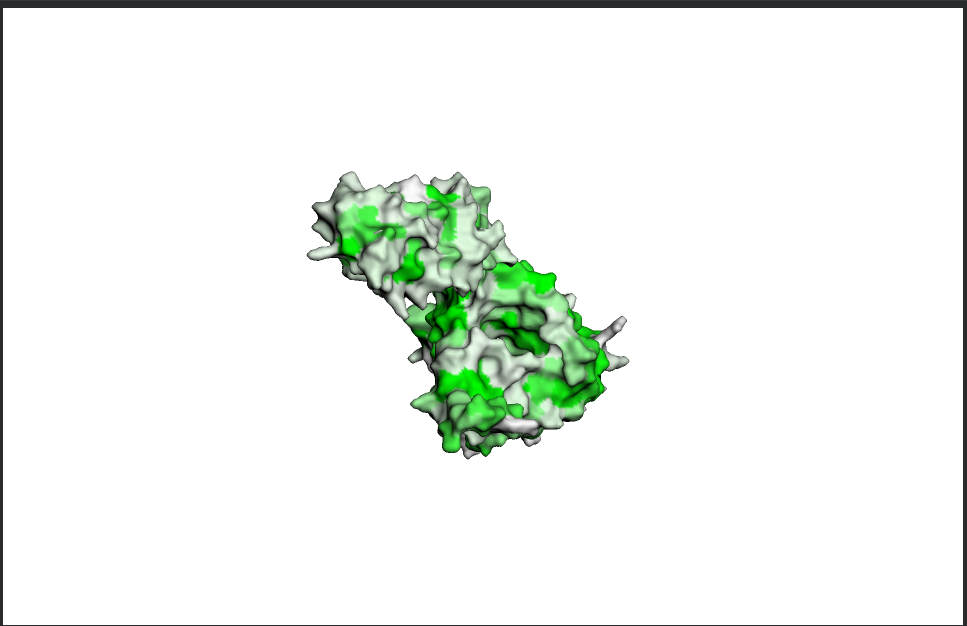
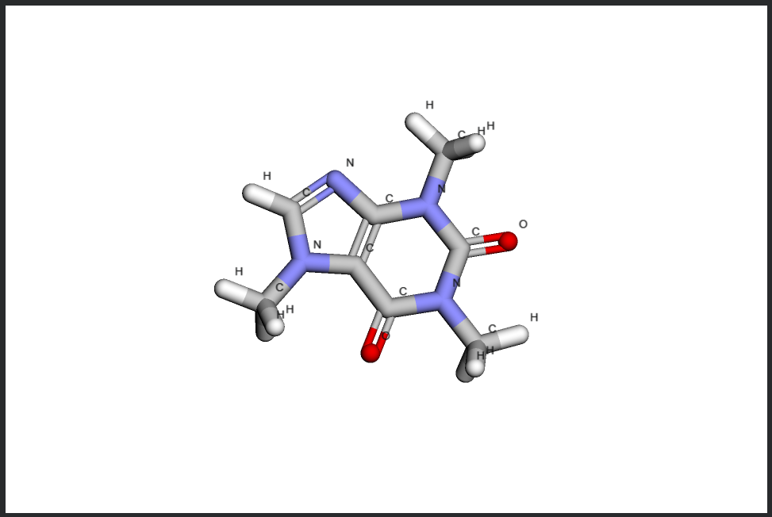

# Докинг лекарственных молекул

Выполнил: **Цой Антон 22214**

## О работе

### 1a. Действующее вещество

Коммерческое наименование: Кофеин

Действующее вещество: Кофеин (Caffeine)

### 1b. Область применения

- стимуляция ЦНС
- повышение бодрствования
- устранение сонливости
- в составе комбинированных анальгетиков

### 1c. Молекулярный механизм действия (кратко)

Кофеин является антагонистом аденозиновых рецепторов A1 и A2A. Блокируя связывание аденозина, он снижает тормозящее влияние аденозина на нейроны, что приводит к повышению нейронной активности и бодрствования. Это сопровождается увеличением высвобождения нейромедиаторов, таких как дофамин и норадреналин.

## 3D-таргет

## 3D-лиганд

## Докинг

- [Ноутбук](./work.ipynb)
- [Результаты докинга](./5N2S-docking/)
